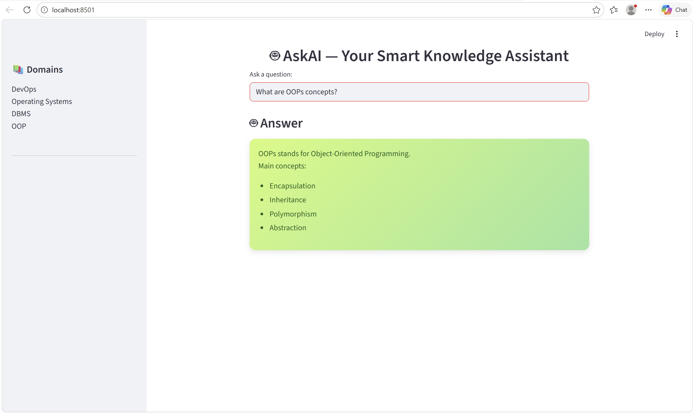

# 🤖 AskAI — Smart Knowledge Assistant (RAG System)

Built an AI-powered Retrieval-Augmented Generation (RAG) system using LangChain, FAISS, and HuggingFace Transformers.

## 📸 UI Preview

  

## 🚀 Features
- Ask questions from custom documents
- Uses semantic search (FAISS)
- Streamlit UI
- No API required (runs locally)

## 🛠️ Tech Stack
- Python
- LangChain
- FAISS
- HuggingFace Transformers
- Streamlit

## ▶️ Run Locally
pip install -r requirements.txt  
streamlit run app.py
